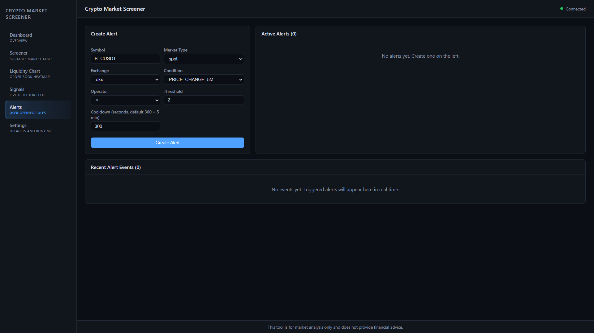
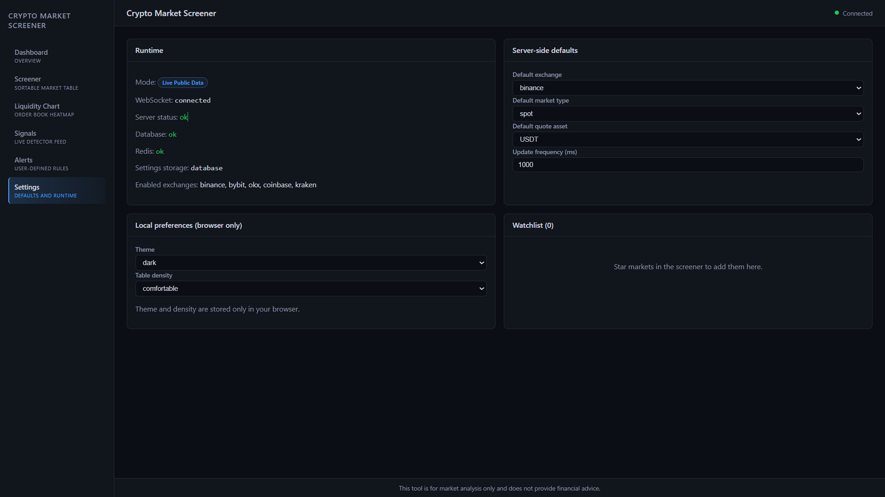
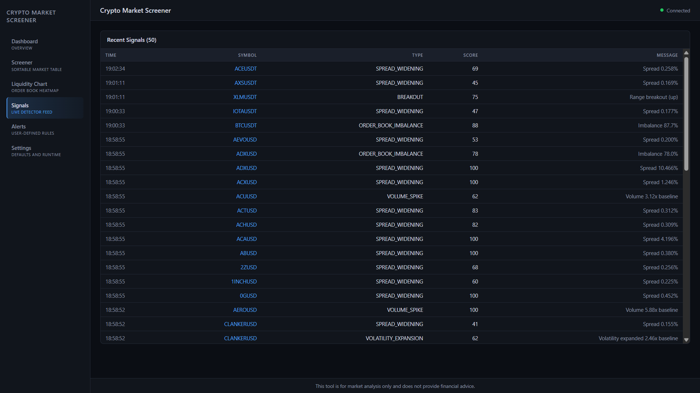
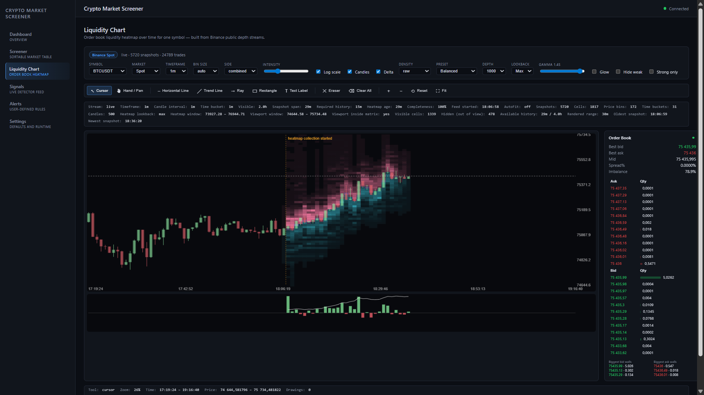
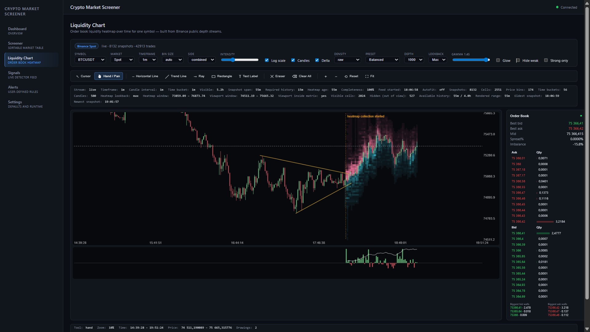
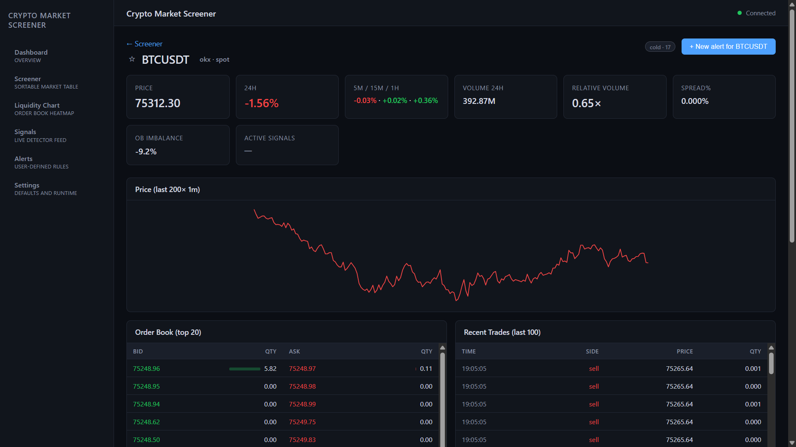
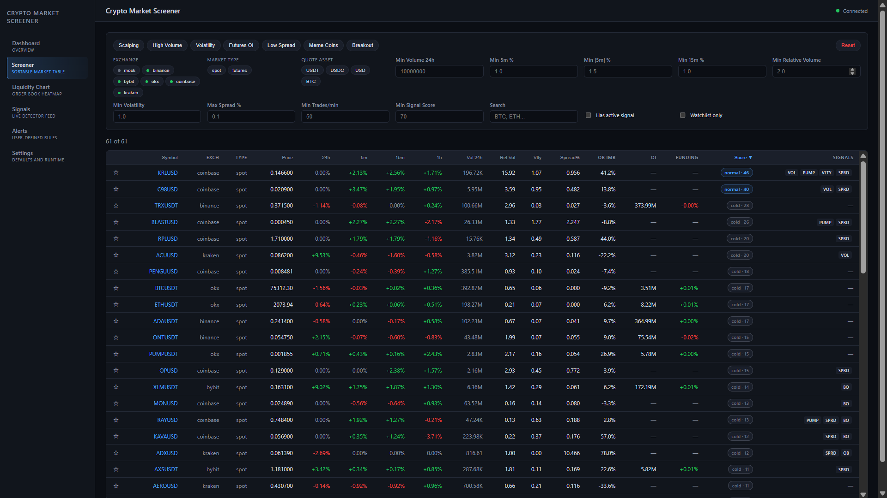

# Crypto Market Screener

[](https://www.typescriptlang.org/)
[](https://nextjs.org/)
[](https://fastify.dev/)
[](https://docs.docker.com/compose/)
[](https://www.postgresql.org/)
[](https://redis.io/)
[](#tests)
[](LICENSE)

A live crypto market intelligence terminal centered around an **interactive order book liquidity heatmap** for Binance plus a multi-exchange screener. The app surfaces unusual market behavior (volume spikes, sharp moves, volatility expansion, spread widening, order book imbalance, OI/funding anomalies, breakouts) and a unified 0–100 hotness score, all in real time over WebSocket.

> The repository is published as `crypto-liquidity-terminal` because the **Liquidity Chart** is the headline feature; in the running UI the product is still labelled "Crypto Market Screener".

> **Disclaimer.** This tool is for market analysis only. It does **not** place trades, does **not** accept exchange API keys, and is **not** affiliated with any exchange. Mock data is for tests/dev only — the default mode is live public data.

## Table of contents

- [Quick start](#quick-start)
- [What you'll see](#what-youll-see)
- [How the Liquidity Heatmap is built](#how-the-liquidity-heatmap-is-built)
- [Stack](#stack)
- [Local development](#local-development)
- [Tests](#tests)
- [Operating modes](#operating-modes)
- [No-subscription data policy](#no-subscription-data-policy)
- [Environment variables](#environment-variables)
- [REST endpoints](#rest-endpoints)
- [WebSocket events](#websocket-events)
- [Project structure](#project-structure)
- [Known limitations](#known-limitations)
- [Troubleshooting](#troubleshooting)
- [License](#license)

---

## Quick start

The app is fully containerized — Postgres, Redis, the Fastify API, and the Next.js web app all come up with one command. Docker Desktop must be running.

```bash
docker compose up -d --build
```

That's it. Wait ~30 seconds for `docker compose ps` to show all four services as `healthy`, then open:

| URL | Page |
|---|---|
| http://localhost:3000 | Dashboard (top gainers/losers, hottest markets, live signal feed) |
| http://localhost:3000/heatmap | **Liquidity Chart** — order book heatmap + candles + volume + order book panel |
| http://localhost:3000/screener | Multi-exchange screener with filters and a 0–100 score |
| http://localhost:3000/markets/BTCUSDT | Market detail (metrics, sparkline, top-20 book, recent trades, signals) |
| http://localhost:3000/alerts | Alert rule builder + active alerts + live events |
| http://localhost:3000/signals | Lightweight feed of all detected signals |
| http://localhost:3000/settings | Runtime mode, exchange status, DB/Redis state |
| http://localhost:4000/health | Static `{status:"ok"}` probe |
| http://localhost:4000/readiness | Operational mode + per-adapter status |

By default the API runs in **live public data** mode (`USE_MOCK_DATA=false`, `ENABLE_PUBLIC_API_ADAPTERS=true`), pulling from Binance, Bybit, OKX, Coinbase, and Kraken via public REST plus a Binance WebSocket for the heatmap. **No API keys are required, ever.**

> **First-load expectations.** The screener fills within ~2 s in mock mode and within ~60 s in live mode (the polling job ticks once a minute by default). The Liquidity Heatmap is **accumulated live** — public exchanges don't expose historical full-depth snapshots, so when you first open `/heatmap` for a symbol you'll see candles immediately (REST backfilled) but the heatmap walls fill in over the next few minutes. The DebugBar above the chart shows progress: `Heatmap age: 60s / 30m collected · 3%`.

Useful follow-up commands:

```bash
docker compose ps                    # health of every service
docker compose logs -f api           # tail API logs
docker compose logs -f web           # tail web logs
docker compose restart api           # restart only the API
docker compose down                  # stop everything
docker compose down -v               # stop and wipe Postgres volume
```

---

## What you'll see

Every screenshot below is from a real live-mode run with all 5 public adapters connected. The captions describe every control on screen so you know what each setting actually does.

The screenshots happen to match this README's order: **Alerts → Settings → Signals → Liquidity Chart (cursor) → Liquidity Chart (with drawings) → Market detail → Screener.**

### Alerts



`/alerts`. Three panels:

- **Create Alert (top-left)** — pick `Symbol` (free-text with auto-complete from tracked markets), `Market Type` (`spot`/`futures`), `Exchange`, `Condition`, `Operator` (`> >= < <= ==`), `Threshold`, and `Cooldown` (default `300` s = 5 min). Eleven `Condition` types live in the dropdown: `PRICE_CHANGE_5M / 15M / 1H / 24H`, `RELATIVE_VOLUME`, `VOLATILITY`, `SPREAD`, `ORDER_BOOK_IMBALANCE`, `SIGNAL_SCORE`, plus the futures-only `OPEN_INTEREST` and `FUNDING_RATE`. The two futures-only options are disabled in the dropdown when `Market Type=spot` and the form rejects mismatched submissions with a Zod `validation_error`.
- **Active Alerts (top-right)** — every saved rule with an enable/disable toggle, last-fired timestamp, and a delete button. Re-enabling a disabled alert resets `lastTriggeredAt` so the cooldown doesn't suppress the next match.
- **Recent Alert Events (bottom)** — live feed of triggered events from the AlertEvaluator (runs every 2 s). Each row has trigger time, symbol, observed value, the threshold it crossed, and a human-readable message.

The blue "Connected" dot in the top-right is the global WebSocket status; it turns red on disconnect.

### Settings + readiness



`/settings` — split into four panels:

- **Runtime (top-left)** — `Mode` is the live operational mode derived from the registry's actual adapter set, not just env intent. `Live Public Data` here means all 5 enabled exchanges are running. `WebSocket: connected` is the live status of the browser ↔ API channel. `Server status: ok` / `Database: ok` / `Redis: ok` come from `GET /readiness`. `Settings storage: database` confirms `PATCH /settings` persists to Postgres; if it falls back to in-memory you'd see `memory fallback` plus an explanatory banner. `Enabled exchanges` is the live list with `*` annotation for any in degraded state.
- **Server-side defaults (top-right)** — `Default exchange / Default market type / Default quote asset / Update frequency (ms)`. Edits go through `PATCH /settings` with optimistic UI mirroring to `localStorage`. The `Update frequency` field is the screener job cadence (250 ms minimum, 1 s default).
- **Local preferences — browser only (bottom-left)** — `Theme` (`dark` / `light`) and `Table density` (`comfortable` / `compact`). These are pure browser state, never sent to the server.
- **Watchlist (bottom-right)** — chips for every starred symbol. Empty when no markets have been starred from the screener; otherwise has a `Clear watchlist` action.

### Signals feed



`/signals` is a fast-scrolling feed of every signal the engine has fired recently. Columns: `Time` / `Symbol` (link to market detail) / `Type` / `Score` / `Message`. Score is the unified 0–100 for that detector firing, not the market's overall hotness — that's why a single market can fire `SPREAD_WIDENING` at 100 (extreme spread) while still being "cold" on the dashboard.

The screenshot shows real recent firings on Kraken / Coinbase markets: `SPREAD_WIDENING` dominates at the top (a few markets had spreads from 0.169% all the way up to 10.466%), `ORDER_BOOK_IMBALANCE` at 88 score (BTCUSDT 87.7% imbalance), `BREAKOUT` at 75 ("Range breakout (up)"), `VOLUME_SPIKE` at 100 ("Volume 5.88× baseline"), and `VOLATILITY_EXPANSION` at 62 ("Volatility expanded 2.46× baseline"). This panel reuses the same store as the Dashboard's "Live Signal Feed" — useful as a passive monitor in a side window.

### Liquidity Chart — full layout



The main view at `/heatmap`. Everything you see is one symbol on one exchange — switching the symbol kicks off a fresh order book WebSocket subscription. The status row above the controls reads `Binance Spot · live · 5 728 snapshots · 74 766 trades` — that's the real-time tally from the dedicated `LiquidityFeed` for BTCUSDT-spot.

**Top control bar (left → right, every field):**

- **Symbol** — Binance USDT pairs from `GET /liquidity/symbols`. Switching kicks off a new WS subscription and resets the chart.
- **Market** — `Spot` or `Futures` (USDT-M perp).
- **Timeframe** — `1m / 5m / 15m`. Drives the **candle** interval (REST `klines`); the heatmap uses its own much finer bucket (default 5 s, see [How it's built](#how-the-liquidity-heatmap-is-built)).
- **Bin size** — price bucket height. `auto` targets ~200 bins across the visible range; fixed `0.1% / 0.25% / 0.5% / 1%` snap to a percentage of mid. Smaller bins = more detail; larger bins = more obvious walls.
- **Side** — `combined` (bids + asks), `bids` only, `asks` only, or `imbalance` (`|bid − ask|` per cell).
- **Intensity** — legacy linear multiplier from the original colour pipeline. The new `Density` modes on the right side override it.
- **Log scale**, **Candles**, **Delta** — toggles for the candle layer, log-scaled colour ramp, and the volume/delta panel below.
- **Density** — normalization mode used to map raw liquidity → cell opacity. `raw` (linear), `log` (log1p compression), `percentile` (rank-based, robust), `zscore` (banded, makes walls pop). The screenshot uses `raw`.
- **Preset** — saved tuple of density settings. `Balanced` is the safe default shown here; `Deep Liquidity` lifts weak cells; `Strong Walls` keeps only top ~15 % of cells; `Weak Liquidity` zooms into thin areas; `Clean` hides sub-noise without glow.
- **Depth** — top-N levels per side fed into the heatmap (`50 / 100 / 250 / 500 / 1000`). Higher = walls farther from mid become visible. Screenshot uses `1000`.
- **Lookback** — how far back into the live ring buffer the heatmap reads (`15m / 30m / 1h / 2h / 4h / max`). Capped by `MAX_HEATMAP_LOOKBACK_HOURS` env (default 4 h). Screenshot uses `Max`.
- **Gamma** — non-linear cell-opacity correction. `< 1` lifts weak cells, `> 1` flattens them. Screenshot shows `1.43`.
- **Glow** / **Hide weak** / **Strong only** — drop sub-threshold cells, keep only top cells, or add an additive halo on top-percentile cells. All three off in the screenshot.

**Chart toolbar (second row):**

`Cursor` (active here) and `Hand / Pan` are the two navigation modes. Then the drawing tools: `Horizontal Line`, `Trend Line`, `Ray`, `Rectangle`, `Text Label`. `Eraser` deletes one drawing on click. `Clear All` wipes every drawing for the current symbol after confirmation. `+` / `−` zoom the time axis; `Reset` snaps the viewport to the timeframe-default visible range; `Fit` is the same.

**DebugBar (third row).** Every diagnostic the heatmap pipeline produces, end to end:

- `Stream: live` — the `LiquidityFeed` WS is open.
- `Time bucket: 1m` — adaptive heatmap bucket width chosen for the current viewport zoom (5 s minimum, 60 s cap).
- `Visible: 2.4h` — what the chart's time axis currently spans.
- `Snapshot span: 5h` — total time covered by stored ring-buffer snapshots.
- `Required history: 15s` — minimum window for the timeframe's default fit.
- `Heatmap age: 5h · Completeness: 100%` — feed has been running long enough to fill its lookback window.
- `Feed started: 18:04:34` — when this WS opened (also the orange dashed marker on the chart).
- `Snapshots: 5728 · Cells: 1517 · Price bins: 172 · Time buckets: 51 · Candles: 500` — sizes through the pipeline. 5 728 raw depth snapshots aggregated into 1 517 visible cells.
- `Heatmap lookback: max · Heatmap window: 73 027.20 – 76 860.71 · Viewport window: 74 664.18 – 75 736.66 · Viewport inside matrix: yes` — the matrix was built around mid ±2 %, the viewport sits comfortably inside it. If you panned/zoomed past the matrix range, an `Outside heatmap window` banner with a `Rebuild for visible range` button would appear.
- `Visible cells: 1339 · Hidden (out of view): 478` — clipping result for the current viewport. Density changes never affect this count; only zoom/pan do.
- `Available history: 2h0 / 4.0h · Rendered range: 55m` — buffer fill vs cap.

**Inside the canvas:**

- **Heatmap cells** — cyan/teal for bid-dominant cells, magenta/pink for ask-dominant, lilac for balanced. Brightness encodes liquidity at that price × time bucket. Stable walls show as horizontal bright streaks across many time slices; ephemeral spoofing flashes briefly.
- **Candles** — overlaid on top of the heatmap, aligned to candle body geometry pixel-for-pixel (the volume bar below sits exactly under each candle body).
- **Dashed white horizontal line** — current mid price.
- **Vertical orange dashed line** with `heatmap collection started` label — the moment the WS feed opened. Anything to the left exists only as candles, not as heatmap.
- **Right axis** — price labels (decimals scale with magnitude). **Bottom axis** — local time `HH:MM:SS`.

**Right-side Order Book panel:** top 12 bids + top 12 asks live with `Best bid / Best ask / Mid / Spread % / Imbalance` summary, refreshed each poll (~2 s). The `Biggest bid walls` / `Biggest ask walls` rows at the bottom call out the largest standing orders.

**Volume / delta histogram below the chart.** In `delta` mode green bars above the centre line are net taker buys, red below are net taker sells, with a thin white line tracing cumulative delta. Falls back to per-candle volume when delta has < 2 buckets.

**Status bar (bottom):** active `Tool`, current `Zoom %`, viewport time range, viewport price range, and drawing count.

### Drawing tools — symmetric triangle on BTCUSDT



The same chart in `Hand / Pan` mode, panned ~3 hours back to the period before the heatmap started, with three trend lines drawn in orange to highlight a converging symmetric-triangle pattern that broke down into the orange-marker zone where live heatmap walls then formed. The DebugBar's `Drawings: 3` field at the right confirms the count.

Geometry note worth understanding: drawings are anchored in **price/time domain coordinates**, not pixels. Zoom and pan move them together with candles instead of dragging them around. The same invariant applies to heatmap cells — viewport changes are pure visual transforms client-side, never a server refetch (the polling loop only refetches on symbol/market/timeframe change or an explicit "Rebuild for visible range" click).

Drawings persist in `localStorage` keyed by `exchange:marketType:symbol`, so navigating away from BTCUSDT and back later restores them. The Eraser tool removes one drawing on click; **Clear All** wipes them for the current symbol after a confirmation prompt.

### Market detail



`/markets/BTCUSDT?exchange=okx&marketType=spot`. Everything for one market in one place.

**Header.** A back-link to the screener, the watchlist star, the symbol with `okx · spot` venue tag, a `cold · 17` score badge (band + numeric score), and a `+ New alert for BTCUSDT` button that jumps to `/alerts?prefill=...` with the form pre-filled.

**Headline metrics.** Six tiles:

- `PRICE 75312.30` — last trade.
- `24H -1.56%` — colour-coded vs zero.
- `5M / 15M / 1H -0.03% · +0.02% · +0.36%` — three windows in one tile.
- `VOLUME 24H 392.87M` — quote-volume.
- `RELATIVE VOLUME 0.65×` — current vs baseline (`< 1` = quieter than usual).
- `SPREAD % 0.000%` — quote spread; near-zero on a deep BTCUSDT book.
- `OB IMBALANCE -9.2%` — signed bid/ask imbalance over visible levels.
- `ACTIVE SIGNALS —` — empty here because BTCUSDT-okx is calm right now; it would show colored signal-type chips when detectors fire.

**Price (last 200 × 1m).** A 60-min mini-chart driven by the same `klines` REST endpoint the heatmap uses. Pure SVG, no canvas — light enough to render hundreds of these on the screener page.

**Order Book (top 20).** Live bids (green) and asks (red) with a per-row green/red `QTY` bar visualising depth. Updates each poll.

**Recent Trades (last 100).** Time / Side / Price / Qty. Each side coloured (green = buy taker, red = sell taker). The screenshot shows a string of small sells on okx — typical low-volume mid-day flow.

Below the visible area (scroll down): Recent Signals for this symbol and an `Alerts for BTCUSDT` mini-panel.

### Screener



`/screener` is the multi-exchange filter table. Every column is sortable; the URL stays in sync with the filter state so you can share a link.

**Preset chips (top row).** One-click filter combos: `Scalping` (high Trades/min, low spread), `High Volume` (top quote-volume), `Volatility` (high `Vlty` column), `Futures OI` (futures only with non-null OI), `Low Spread` (`Spread % < threshold`), `Meme Coins` (curated symbol set), `Breakout` (recently fired `BREAKOUT` signal). The `Reset` button clears everything.

**Filters.** Exchange checkboxes (`mock / binance / bybit / okx / coinbase / kraken`), `Market Type` (`spot` / `futures`), `Quote Asset` (`USDT / USDC / USD / BTC`), `Min Volume 24h`, `Min 5m %`, `Min 15m %`, `Min 1h %`, `Min Relative Volume`, `Min Volatility`, `Max Spread %`, `Min Trades/min`, `Min Signal Score`, `Search` (text search over symbol), `Has active signal`, `Watchlist only`.

**Table columns.** `Symbol` (link to market detail), `Exch`, `Type`, `Price`, `24H`, `5m`, `15m`, `1h`, `Vol 24h`, `Rel Vol`, `Vlty`, `Spread %`, `OB Imb`, `OI`, `Funding`, `Score`, `Signals`. The screenshot shows 61 markets passing the active filters; the `Score` column is currently the active sort (descending arrow).

**Score column.** Unified 0–100 from `screener-engine`. Bands: `cold (0–24)` / `normal (25–60)` / `hot (61–80)` / `extreme (81–100, default `HOT_MARKET` threshold)`. Each row's pill is colour-coded.

**Signals column.** Compact badges for active detectors. Visible in the screenshot: `VOL` (volume spike), `PUMP` (price pump), `VLTY` (volatility expansion), `SPRD` (spread widening), `BO` (breakout), `OB` (order book imbalance). Clicking a badge isn't a navigation — they're status-only chips; click the symbol link instead.

**Star (★).** Toggles the row in the watchlist; persisted in `localStorage`. With `Watchlist only` checked the table filters down to starred rows.

**Sortable headers.** Numeric columns sort numerically server-side; `Symbol`/`Exch`/`Quote` use `localeCompare` (lex order). Live updates flow via WebSocket `market:batch` messages every 750 ms — values pulse without re-rendering the whole table.

---

## How the Liquidity Heatmap is built

The heatmap is the heart of this project. It is **not** a recording from a paid data provider; it is reconstructed live in your machine from Binance's free public WebSocket. Here's the full pipeline so you understand both what you're looking at and why some properties of a paid product (e.g. instant 24 h history) are physically impossible without a subscription.

### 1. Order book reconstruction

For each `(symbol, marketType)` the API spawns one `LiquidityFeed` (lazy, on first request to `/liquidity/:symbol/snapshot`). It does three things in parallel:

- **REST snapshot** — `GET /api/v3/depth?limit=1000` (or `/fapi/v1/depth` for perp). This gives the **initial book state with a `lastUpdateId`**. Diffs received earlier than this id are dropped; from this id forward the book is rebuilt incrementally.
- **WebSocket subscription** — `wss://stream.binance.com:9443/stream?streams=<sym>@depth@100ms/<sym>@aggTrade/<sym>@kline_1m`. The depth diff stream emits `{ U, u, b: [[price, qty], …], a: [[price, qty], …] }` every 100 ms.
- **Bridged-diff gap detection** — the first diff after the snapshot must straddle the snapshot id (`U <= lastUpdateId+1 <= u`). Every diff after that must be **strictly contiguous** (`U === lastUpdateId + 1`); any gap triggers an automatic resync (refetch the snapshot, replay buffered diffs). This is what protects the heatmap from silently rendering a desynced book.

`OrderBookReconstructor` keeps the live top-of-book in two sorted maps (bids descending, asks ascending) and exposes `topOfBook(N)`.

### 2. Top-of-book sampling

Every 250 ms the feed grabs `topOfBook(1000)` and pushes one `DepthSnapshot { t, bids, asks, midPrice }` into a fixed-capacity ring buffer (`DepthSnapshotStore`). At 4 Hz × 4 hours that's 57 600 samples — about 1.5 GB of in-memory state per symbol if you keep depth=1000, which is why `MAX_HEATMAP_LOOKBACK_HOURS` is bounded (default 4 h, configurable up to whatever your machine can hold).

### 3. Aggregation into a price × time grid

When the frontend asks for `GET /liquidity/:symbol/snapshot`, the API runs `LiquidityHeatmapBuilder.buildHeatmap()`:

- **Time bucket** — default 5 s, capped at 60 s. The frontend computes an adaptive value to target ~120 columns across the visible viewport, then sends it as `?heatmapBucketMs=`. The heatmap is therefore **decoupled from the candle timeframe** — on a 5-minute timeframe each candle still gets 60 / 300 = 0–60 heatmap columns inside it, so density isn't collapsed into one fat block.
- **Price bin** — chosen by `chooseBinWidth` from the `Bin size` control. Auto picks ~200 bins across the visible price corridor; fixed values snap to a percentage of mid.
- **Price window clamp** — heatmap range is hard-capped at ±2 % of mid by default. This is critical: the order book has thousand-level tails ($45k bids when mid is $77.9k) which would otherwise stretch the visible range and turn everything into a single column. The frontend can override the cap by passing explicit `priceMin`/`priceMax` (which only happens when you click "Rebuild for visible range").
- **Cell value** — for each bid/ask level inside the window, add `price × qty` (notional) to the matching `(timeBucket, priceBin)` cell. Bid contributions go to `bidLiquidity`, ask to `askLiquidity`, total to `totalLiquidity`.

The result is the `HeatmapMatrix` you see in the polling response: `{ cells: [{t, price, bidLiquidity, askLiquidity, totalLiquidity, intensity}, …], priceMin, priceMax, binWidth, debugStats, … }`.

### 4. Density normalization (frontend)

Raw notional values are skewed: one whale wall can be 100× the median, washing out everything else. The frontend runs each cell through a **density pipeline** before rendering:

- **Mode**: `raw` (linear), `log` (log1p compression), `percentile` (rank-based, robust), `zscore` (banded — 0.5 → 1.5σ → 2.5σ → 4σ — gives walls clearly defined visual classes). Default: `zscore`.
- **Cap percentile** (default `0.99`) — clamp normalization at the 99th percentile so a single outlier doesn't blow out the scale.
- **Gamma** (default `0.6`) — `intensity := pow(intensity, gamma)`. `< 1` lifts weak cells, `> 1` flattens them.
- **Min/max opacity** — alpha range applied to non-zero cells.
- **Hide weak / Strong only** — drop cells below thresholds.
- **Glow** — additive overlay on cells with raw normalized value `≥ 0.85`. Drawn in a second pass with `globalCompositeOperation = "lighter"`.

All five **Presets** (`Balanced` / `Deep Liquidity` / `Strong Walls` / `Weak Liquidity` / `Clean`) are just saved tuples of these values. Switching presets only changes appearance — the underlying matrix is unchanged.

### 5. Rendering invariants

- **Zoom and pan are pure client-side transforms.** Wheel zoom and drag pan update the viewport; the polling loop does not refetch the snapshot. The matrix is built server-side around mid (the stable corridor), the frontend clips cells to the viewport client-side.
- **Cells use absolute domain coordinates.** A cell stores `t` (ms epoch) and `price` (lower bound of the bin), not pixel positions or bin indices. Pan + zoom never move them visually relative to the candles.
- **Density changes don't move geometry.** Switching between `Balanced` and `Strong Walls` only changes alpha/visibility — never time or price.
- **Out-of-range banner.** If the viewport drifts so that less than 50 % of its price span overlaps the loaded matrix window, a banner appears with a `Rebuild for visible range` button. Click it once → next polling tick rebuilds the matrix server-side around the new range. A toast confirms the rebuild was applied.

### 6. Polling cadence and resilience

- The heatmap page polls `liquiditySnapshot + liquidityCandles + liquidityOrderBook + liquidityDelta` every 2 s.
- On consecutive failures the polling delay grows exponentially (2 s → 4 s → 8 s → 16 s → 30 s cap), recovering instantly on the first success — no DDoS-ing a struggling upstream.
- `binSize`, `depthLevels`, `heatmapLookback`, and `heatmapBucketMs` are read via refs so changing them does **not** clear the previous matrix or restart the polling loop. The next tick simply uses the new value.
- Public API failures fall through to the `publicFetch` cache (TTL 30 s). Adapter-level rate limits (429/418/5xx) trigger a backoff window honouring `Retry-After`.

### 7. Why "accumulated live"

Public exchanges do not expose historical full-depth snapshots — only the top-of-book ticker time-series and candles. The heatmap therefore starts empty and grows as long as the symbol's WebSocket stays connected. `/heatmap` is designed around this constraint:

- A vertical orange dashed line shows the moment the feed opened.
- The DebugBar shows live coverage (`Heatmap age: Xs / Ys collected · Z%`).
- The candle layer is REST-backfilled (last 500 candles for the chosen timeframe) so even at second 0 the chart isn't blank.
- After 5–15 minutes you'll have a usable heatmap; after 30+ minutes walls become statistically meaningful.

Per-feed buffers persist in API memory across page reloads, so revisiting the same symbol later resumes from the existing history. Switching containers (`docker compose down && up`) wipes everything.

---

## Stack

- **Frontend** — Next.js 14 (App Router) · React 18 · Zustand 4 · canvas-based liquidity renderer (no chart library — bars and cells are drawn pixel-aligned).
- **Backend** — Fastify 5 · Prisma 5 · ioredis 5 · `ws` via `@fastify/websocket`.
- **Shared** — Zod schemas + TypeScript types in `packages/shared`.
- **Engine** — pure detector + score logic in `packages/screener-engine`, no I/O.
- **Tests** — Vitest + fast-check property tests for the engine.
- **Infra** — Docker Compose (`web`, `api`, `postgres:16-alpine`, `redis:7-alpine`) with healthchecks and `depends_on: condition: service_healthy`.

## Local development

If you'd rather run things without Docker:

```bash
pnpm install
# In two terminals:
pnpm --filter @screener/api dev
pnpm --filter @screener/web dev
```

Postgres and Redis are optional. The API logs warnings if either is missing and continues — alerts and alert events fall back to in-memory storage, `PATCH /settings` returns 200 with `storage: "memory"`, and the UI mirrors the choice to `localStorage` so it survives reloads.

If you want only the data services in Docker and the apps locally:

```bash
docker compose up -d postgres redis
pnpm --filter @screener/api dev
pnpm --filter @screener/web dev
```

## Tests

```bash
pnpm typecheck                                # all 4 typed packages clean
pnpm test                                     # 295 tests across all packages
pnpm --filter @screener/engine test           # 28 unit + property tests
pnpm --filter @screener/api test              # 124 fastify.inject integration tests
pnpm --filter @screener/web test              # 143 frontend unit + interaction tests
pnpm --filter @screener/web build             # production Next.js build
docker compose config --quiet                 # validate compose
```

Property-based tests (fast-check) cover engine invariants. Integration tests cover health/readiness, markets, screener, alerts CRUD, settings fallback, multi-exchange aggregation, live polling, adapter health, operating modes, and the full liquidity heatmap pipeline including the strict-bridge gap detection and the order book reconstructor.

## Operating modes

The mode is determined by `USE_MOCK_DATA` and `ENABLE_PUBLIC_API_ADAPTERS`. `/readiness` reports `mode: "live" | "mock" | "hybrid"` based on the **actual registered adapters**, not just env intent — so the safety-net case (everything disabled → fallback to mock) correctly reports `mode: "mock"`.

### Live public mode (default)

```env
USE_MOCK_DATA=false
ENABLE_PUBLIC_API_ADAPTERS=true
ENABLED_EXCHANGES=binance,bybit,okx,coinbase,kraken
```

`MockExchangeAdapter` is **not** constructed. The `LivePollingJob` polls each adapter every `LIVE_POLLING_INTERVAL_MS` (default 60 s), fetches markets/tickers/klines/orderbook/trades/futures-metrics for the first `LIVE_POLLING_SYMBOL_LIMIT` symbols per exchange, and feeds the resulting `ScreenerResult` rows into `MarketDataStore`. The Liquidity Chart at `/heatmap` runs the dedicated Binance WebSocket pipeline described above.

### Mock-only mode (tests / dev)

```env
USE_MOCK_DATA=true
ENABLE_PUBLIC_API_ADAPTERS=false
```

Mock fixtures replace all live data. No outbound HTTP calls. Used for tests and offline dev — not the product mode.

### Hybrid mode

```env
USE_MOCK_DATA=true
ENABLE_PUBLIC_API_ADAPTERS=true
```

Both adapter sets run. The store key is `exchange:marketType:symbol`, so `BTCUSDT` on Binance and `BTCUSDT` on the mock adapter coexist as separate rows.

### Safety nets

- `ENABLE_PUBLIC_API_ADAPTERS=false` AND `USE_MOCK_DATA=false` → registry detects the empty set and falls back to mock so the app is never empty. `/readiness.mode` correctly reports `"mock"`.
- Unknown names in `ENABLED_EXCHANGES` are silently ignored.
- Public-adapter network failures do not crash the app — the affected adapter is marked `degraded` in `/readiness` and serves cached data.

## No-subscription data policy

This project is designed to run end-to-end **without any paid API subscriptions or required API keys**.

### Adapter capability matrix

| Exchange | Spot | Futures | Order book | Trades | Klines | Funding | OI | Requires key |
|---|---|---|---|---|---|---|---|---|
| binance | ✓ | ✓ | ✓ | ✓ | ✓ | ✓ | ✓ | no |
| bybit | ✓ | ✓ | ✓ | ✓ | ✓ | ✓ | ✓ | no |
| okx | ✓ | ✓ | ✓ | ✓ | ✓ | ✓ | ✓ | no |
| coinbase | ✓ | — | ✓ | ✓ | ✓ | — | — | no |
| kraken | ✓ | — | ✓ | ✓ | ✓ | — | — | no |
| mock | ✓ | ✓ | ✓ | ✓ | ✓ | ✓ | ✓ | no |

WebSocket subscriptions in `ExchangeAdapter` are no-ops on every public adapter. Live screener data flows via REST polling. The Liquidity Chart pipeline at `/heatmap` is a separate path that does use Binance public WebSocket streams directly.

### Excluded by design

- No paid SaaS providers. `DISABLE_PAID_PROVIDERS=true` by default.
- No coin metadata provider. `MARKET_METADATA_PROVIDER=none`.
- No Authorization headers, ever, in `publicFetch`. Adapters never read API key env vars.

### Resilience

- Hard timeout on every `publicFetch` (`EXTERNAL_API_TIMEOUT_MS`, default 5 s).
- Successful responses are cached for `EXTERNAL_API_CACHE_TTL_SECONDS` (default 30 s).
- 429 / 418 / 403 / 5xx → backoff window honouring `Retry-After`, fallback 30 s; cached value is served meanwhile.
- Network errors fall through silently — the screener and WebSocket continue with whatever data is available.

## Environment variables

See `.env.example` for the full list. Highlights:

| Variable | Default | Purpose |
|---|---|---|
| `USE_MOCK_DATA` | `false` | Toggle the mock adapter (tests/dev). |
| `ENABLE_TEST_FIXTURES` | `false` | Alias of `USE_MOCK_DATA` used in tests. |
| `ENABLE_PUBLIC_API_ADAPTERS` | `true` | Toggle public-API adapters. |
| `ENABLED_EXCHANGES` | `binance,bybit,okx,coinbase,kraken` | Allowlist of public adapters. |
| `MOCK_MARKET_COUNT` | `80` | Number of mock markets (50–100). _Mock-mode only._ |
| `MOCK_UPDATE_INTERVAL_MS` | `750` | Mock tick rate. _Mock-mode only._ |
| `MOCK_SEED` | `42` | PRNG seed. _Mock-mode only._ |
| `SCREENER_INTERVAL_MS` | `1000` | Screener job cadence. |
| `ALERT_INTERVAL_MS` | `2000` | Alert evaluator cadence. |
| `LIVE_POLLING_INTERVAL_MS` | `60000` | Live REST polling cadence. |
| `LIVE_POLLING_SYMBOL_LIMIT` | `15` | Symbols per adapter per cycle. |
| `WS_BATCH_INTERVAL_MS` | `750` | WebSocket batch flush (500–1000). |
| `WS_BATCH_MAX_ENTRIES` | `500` | Max entries per `market:batch`. |
| `DATABASE_URL` | unset | Postgres connection (optional). |
| `REDIS_URL` | unset | Redis connection (optional). |
| `CORS_ORIGINS` | `http://localhost:3000` | Allowed CORS origins. |
| `RATE_LIMIT_MAX` | `120` | Max requests per window. |
| `RATE_LIMIT_WINDOW_MS` | `60000` | Rate limit window. |
| `HOT_MARKET_SCORE_THRESHOLD` | `81` | Score threshold for `HOT_MARKET` signal. |
| `EXTERNAL_API_TIMEOUT_MS` | `5000` | Per-call timeout. |
| `EXTERNAL_API_CACHE_TTL_SECONDS` | `30` | Cache TTL. |
| `MAX_HEATMAP_LOOKBACK_HOURS` | `4` | Memory cap for the depth-snapshot ring buffer. Drives both the per-feed buffer capacity and the `lookback=max` ceiling on `/liquidity/:symbol/snapshot`. |

## REST endpoints

Base routes:

| Endpoint | Description |
|---|---|
| `GET /health` | `{ status: "ok", serverTime }` (no I/O) |
| `GET /readiness` | `{ status, mode, mockEnabled, publicAdaptersEnabled, db, redis, exchangeAdapters[], serverTime }` |

Markets / screener / signals:

| Endpoint | Description |
|---|---|
| `GET /markets` | All tracked markets |
| `GET /markets/:symbol?exchange=&marketType=` | Single market (404 if unknown). Optional `exchange` / `marketType` disambiguate when the same symbol exists on multiple venues. |
| `GET /markets/:symbol/klines?limit=200&interval=1m&exchange=&marketType=` | Recent candles |
| `GET /markets/:symbol/orderbook?exchange=&marketType=` | Top N bids and asks (N from `MARKET_DETAIL`) |
| `GET /markets/:symbol/trades?limit=100&exchange=&marketType=` | Recent trades |
| `GET /screener?...` | Filtered screener (query params); `sortColumn` accepts both numeric and string columns (`symbol`/`exchange`/`quoteAsset` use `localeCompare`). |
| `POST /screener/query` | Filtered screener (JSON body) |
| `GET /signals?symbol=&type=&limit=50` | Recent signals |
| `GET /signals/:symbol` | Recent signals for one symbol |

Alerts / settings:

| Endpoint | Description |
|---|---|
| `POST /alerts` | Create alert; 400 with `validation_error` for FUNDING_RATE/OPEN_INTEREST on spot |
| `GET /alerts` | List alerts |
| `GET /alerts/:id` | Get alert (404 if unknown) |
| `PATCH /alerts/:id` | Update alert; `enabled: true` after `false` resets `lastTriggeredAt` |
| `DELETE /alerts/:id` | Delete alert (204) |
| `GET /alert-events?limit=100&alertId=...` | Triggered alert events |
| `GET /settings` | Server-side defaults; returns `storage: "database" \| "memory"` and `persisted` |
| `PATCH /settings` | Update settings; **returns 200** with `storage: "memory"` and a `warning` when DB is unavailable (in-memory fallback) |

Liquidity (Binance-only):

| Endpoint | Description |
|---|---|
| `GET /liquidity/symbols?marketType=spot\|futures` | Common Binance USDT pairs |
| `GET /liquidity/:symbol/snapshot?marketType=&timeframe=1m\|5m\|15m&binSize=&lookbackMinutes=&heatmapBucketMs=&levels=&priceMin=&priceMax=` | Heatmap matrix + `debugStats` + `lookback` echo + `status` |
| `GET /liquidity/:symbol/orderbook?levels=` | Live top-of-book + spread/imbalance |
| `GET /liquidity/:symbol/trades?limit=` | Recent aggregated trades |
| `GET /liquidity/:symbol/delta?timeframe=&limit=` | Bucketed delta (buy/sell volume + cumulative) |
| `GET /liquidity/:symbol/candles?interval=1m\|5m\|15m&limit=` | Klines at the requested interval |

### Error envelope

```
{
  "error": "validation_error" | "not_found" | "RATE_LIMITED" | "service_unavailable" | ...,
  "message": "<human readable, ≤ 500 chars>",
  "statusCode": 400 | 404 | 429 | 503 | ...,
  "details"?: <field-level info>,
  "retryAfterSeconds"?: <number, only on 429>
}
```

Rate-limited responses also carry a `Retry-After` header.

## WebSocket events

Channel: `ws://localhost:4000/ws`

| Event | When | Payload |
|---|---|---|
| `snapshot` | On connect | `{ markets ≤300, recentSignals ≤50, recentAlertEvents ≤50, serverTime }` |
| `market:batch` | Every `WS_BATCH_INTERVAL_MS` (default 750 ms) | `{ results: ScreenerResult[] (≤500), ts }` |
| `signal:new` | Within 500 ms of detection | `{ signal: Signal }` |
| `alert:triggered` | When AlertEvaluator fires | `{ event: AlertEvent }` |

Frontend WebSocket client uses exponential backoff (1 s → 30 s, factor 2) and a 250 ms `market:batch` throttle. Multiple components share one connection via refcount, so navigating between pages doesn't reconnect.

## Project structure

```
.
├── apps/
│   ├── api/                          # Fastify backend
│   │   ├── prisma/schema.prisma      # Postgres schema
│   │   └── src/
│   │       ├── adapters/             # AdapterRegistry, Mock, Binance, Bybit, OKX, Coinbase, Kraken, normalize, publicFetch
│   │       ├── cache/                # Redis client wrapper
│   │       ├── config/               # Env Zod schema
│   │       ├── db/                   # Prisma client w/ best-effort connect + reconnect
│   │       ├── jobs/                 # ScreenerJob, AlertEvaluator, LivePollingJob
│   │       ├── market-depth/         # OrderBookReconstructor, DepthSnapshotStore, LiquidityFeed,
│   │       │                         # LiquidityFeedManager, LiquidityHeatmapBuilder,
│   │       │                         # PriceBinner, DeltaCalculator, TradeBuffer, RingBuffer
│   │       ├── plugins/              # Error handler
│   │       ├── routes/               # health, markets, screener, signals, alerts, settings, liquidity
│   │       ├── state/                # MarketDataStore, AlertStore (DB or in-memory)
│   │       ├── ws/                   # WebSocketHub
│   │       ├── __tests__/            # fastify.inject integration + adapter + policy tests
│   │       ├── server.ts             # buildServer (with startJobs flag for tests)
│   │       └── index.ts              # Boot + graceful shutdown
│   └── web/                          # Next.js 14 frontend
│       ├── src/
│       │   ├── app/                  # App Router pages
│       │   ├── components/           # Sidebar, FilterPanel, liquidity/*, heatmap/*, …
│       │   ├── lib/                  # api, ws, filters, presets, format, chart/*, liquidity/*
│       │   ├── state/                # zustand stores
│       │   └── __tests__/            # vitest unit + interaction tests
│       └── Dockerfile
├── packages/
│   ├── shared/                       # Zod schemas + TS types (the contract)
│   └── screener-engine/              # Pure metrics, detectors, score
├── docs/screenshots/                 # Screenshots used in this README
├── scripts/take-screenshots.ts       # Playwright screenshot tool
├── docker-compose.yml
├── pnpm-workspace.yaml
├── tsconfig.base.json
├── package.json
├── .env.example
└── README.md
```

## Known limitations

- **Liquidity Chart is Binance-only.** Other public adapters (Bybit / OKX / Coinbase / Kraken) feed the screener but not the heatmap, because their depth-diff protocols differ.
- **Historical heatmap is accumulated live.** Public exchanges don't expose historical full-depth snapshots; the heatmap starts populating from the moment the WS connects. The DebugBar shows progress.
- **WebSocket subscriptions on screener-side adapters are no-ops.** Live screener data is REST-polled at `LIVE_POLLING_INTERVAL_MS`. The dedicated Binance liquidity feed is the only WS subscription that does real work.
- **Single-user MVP.** No authentication or session management.
- **Notification channels.** Only WebSocket broadcasts. Email / Telegram are out of scope.

## Troubleshooting

### `pnpm` not found

Install via npm: `npm install -g pnpm@9.7.0`. The repo also ships an `.nvmrc` pinning Node `20.16.0` (LTS); run `nvm use` if you have nvm-windows or fnm.

### `next/dist/...processChild.js` missing after install

Known Windows + Node 24 + pnpm interaction. Fix:

```powershell
Remove-Item -Recurse -Force node_modules
pnpm install --force
```

### `docker compose up` fails on `dockerDesktopLinuxEngine`

Docker Desktop is not running. Start Docker Desktop and retry.

### `db: unavailable` even though Postgres is healthy

Symptom: `/readiness` reports `redis: ok`, Postgres container is `healthy`, but `db: unavailable` and the API logs `Error loading shared library libssl.so.1.1`.

This is the Prisma 5 + Alpine query-engine + missing OpenSSL combination. The API `Dockerfile` installs `apk add --no-cache openssl libc6-compat` to fix it. If you still see the error, rebuild without cache: `docker compose build --no-cache api && docker compose up -d`.

### `RATE_LIMITED` 429 responses

Default limit is 120 requests / 60 s per IP. Tune `RATE_LIMIT_MAX` and `RATE_LIMIT_WINDOW_MS`.

### Heatmap looks empty right after page load

By design — see [How the Liquidity Heatmap is built → Why "accumulated live"](#7-why-accumulated-live). Candles backfill from REST instantly; depth walls fill in over the next 5–15 minutes. The DebugBar shows live progress.

### Heatmap walls disappear when I zoom

They shouldn't — zoom and pan are pure client-side transforms. If you do see this:

1. Check the DebugBar's `Visible cells` count. If it stays high but you don't see them, it's a rendering issue worth filing.
2. If you see the "Viewport drifted outside the loaded heatmap price window" banner, your viewport is mostly outside the matrix range. Click `Rebuild for visible range` once.
3. If the matrix itself emptied out, the WebSocket might have dropped — check `/readiness` for the Binance adapter status and `docker compose logs -f api` for `LiquidityFeed WS` lines.

### Screenshots / re-generating screenshots

Screenshots used here live under `docs/screenshots/`. To re-generate them automatically with Playwright after running the stack:

```bash
pnpm install -D playwright
npx playwright install chromium
pnpm tsx scripts/take-screenshots.ts
```

For ad-hoc shots: `Win + Shift + S` (Windows Snipping Tool), save under the same path, or attach inline in a PR.

## Safety note

This project explicitly does not implement order placement or position management. There is no API surface for trading API keys. Code paths that could be confused for trading do not exist.

## License

[MIT](LICENSE) © Crypto Liquidity Terminal contributors.
